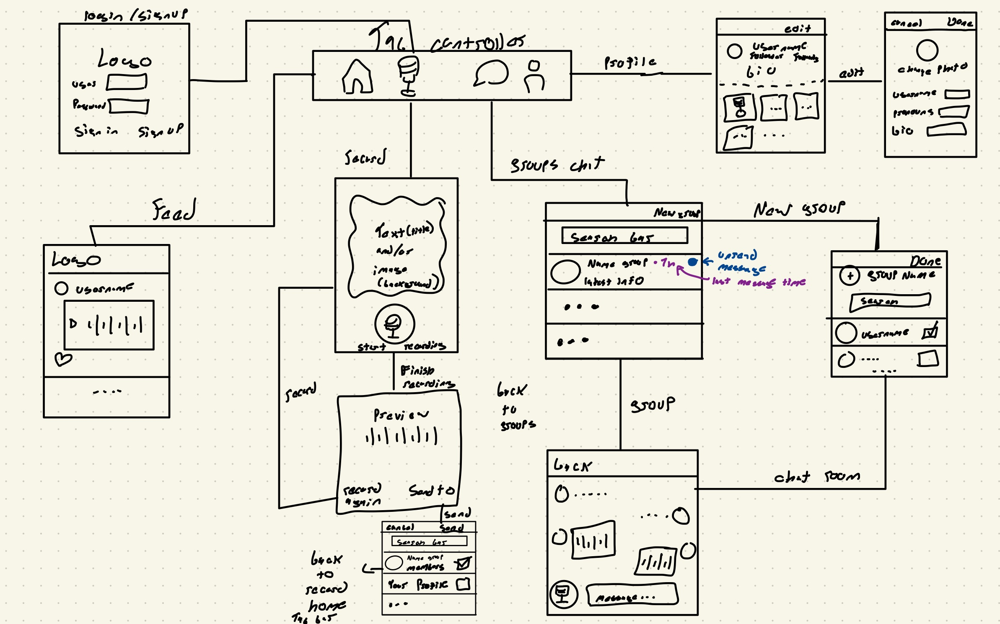

Original App Design Project
===

# HearMee (Unofficial name)

## Table of Contents
1. [Overview](#Overview)
1. [Product Spec](#Product-Spec)
1. [Wireframes](#Wireframes)
2. [Schema](#Schema)

## Overview
### Description
A social networking app but the main element is by using voice. You can create mini podcast with your groups (family, friends, or even just by yourself!) and share funny stores, updates in your life or just talking nonsense. Later, when you share your audio, the others participant of the group can reply by text or with another mini podcast. 

### App Evaluation
[Evaluation of your app across the following attributes]
- **Category:** Social Networking
- **Mobile:** The app can create differents groups where there you can send voice with a time-limit about any topics. There the members can hear your mini podcast and reply with another podcast or by text.
- **Story:** share your updates in life, tell jokes or debate in silly things by mini podcast to your groups.
- **Market:** Is open to any podcast lover. Podcast is a market where the majority of the users go back to hear more and mainly in their phones.
- **Habit:** Users continuously come back to keep up to date and communicate with their groups.
- **Scope:** v1 Voice Chats between members of a group with a function to reply by text and/or another mini podcast. v2 share your mini podcast outside of the app. v3 using spotify sdk to search podcast inside the app

## Product Spec

### 1. User Stories (Required and Optional)

**Required Must-have Stories**

* Chat
    * Must have voice-chat and reply options for text and voice
* Profile
    * profile pictures
    * short description
    * username
* Groups
    * create a group of your contacts with a name, description and display image so that all can chat in one chat thread.
* Settings
* Spotify podcast SDK
    * can search, play, and share podcasts that are in spotify

**Optional Nice-to-have Stories**

* Status
    * if the person is online or last active
* share
    * you can share your mini podcast outside of the app 
* Onboarding
    * First-time user visual tutorial for how the app works

### 2. Screen Archetypes

* Login / Register - User signs up or logs into their account
* Stream - User can scroll through important resources in a list
* Detail - User can view the specifics of a particular resource
* Creation - User can create a new resource
* Profile - User can view their identity and stats
* Settings - User can configure app options
* Messaging - Real-time in group conversations
* Media Players - Allowing the control of media playback

### 3. Navigation

**Tab Navigation** (Tab to Screen)

-Table View-
* Profile
    * profile details view
* Groups 
    * group details views
    * voice view
    * reply view
* Settings
    * setting view

**Flow Navigation** (Screen to Screen)

* profile picture
* new voice button
* reply text view
* table views
* settings buttons
* audio playback 


## Wireframes



### [BONUS] Digital Wireframes & Mockups

### [BONUS] Interactive Prototype

## Schema 
[This section will be completed in Unit 9]
### Models

| Property        | Type            | Description                                         |
|-----------------|-----------------|-----------------------------------------------------|
| objectID        | String          | unique id for the user post (default field)         |
| author          | Pointer to User | image and username author                           |
| image           | File            | image that user posts                               |
| audio           | File            | audio that user posts                               |
| caption         | String          | image caption by author                             |
| likesCount      | Number          | number of likes for the post                        |
| commentsCount   | Number          | number of comments that has been posted to an image |
| createdAt       | DateTime        | date when post is created (default field)           |
| likedByUsername | Array           | array of who like one specific post                 |

### Networking

**List of network request by screen**

* FeedViewController
  * (Read/GET) Query all posts where user is author
      ```objective-c
      PFQuery *postQuery = [Post query];
          [postQuery orderByDescending:@"createdAt"];
          [postQuery includeKey:@"author"];
          postQuery.limit = 20;

          // fetch data asynchronously
          [postQuery findObjectsInBackgroundWithBlock:^(NSArray<Post *> * _Nullable posts, NSError * _Nullable error) {
              if (posts) {
                  self.posts = (NSMutableArray *) posts;
                  [self.tableView reloadData];
              }
              else {
                  NSLog(@"%@", error.localizedDescription);
              }
              [self.refreshControl endRefreshing];
          }];
      ```
   * (Create/POST) Create a new like on a post
   * (Delete) Delete existing like
   * (Create/POST) Create a new comment on a post
* ComposeViewController
   * (Create/POST) Create a new post, minimum the audio (optionals text and image)
* ProfileViewController
   * (Read/GET) Query logged in user object
   * (Update/PUT) Update user profile image
* DMViewController
   * (Read/GET) Query logged user is author
   * (Create/POST) Create a new message on the chat


- [Add list of network requests by screen ]
- [Create basic snippets for each Parse network request]
- [OPTIONAL: List endpoints if using existing API such as Yelp]
